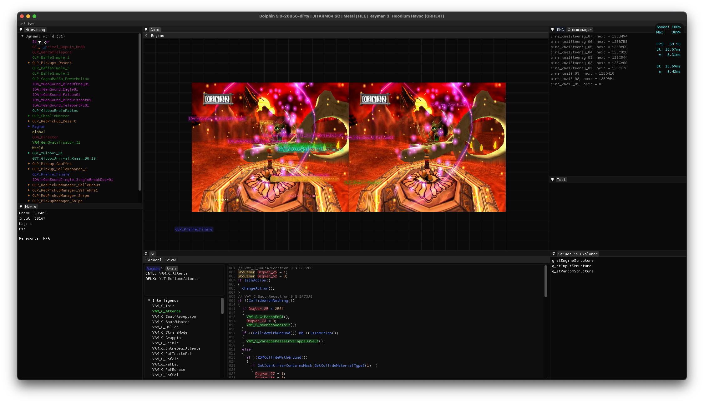

# r3-tas

r3-tas is a utility tool for creating Tool-Assisted Speedruns of Rayman 3, and for viewing the internals of the game. Compatible with [this dolphin emulator fork](https://github.com/Jba03/dolphin).

## Installation
1. Download the latest release of the [dolphin fork](https://github.com/Jba03/dolphin).
2. Download the latest r3-tas dll, and place it in any desired directory.
3. In the configuration file **Dolphin.ini** (found in dolphin's resource directory), under **[General]**, add the field **ExternalToolsPath** and set it to the path of *the directory* in which you placed the r3-tas dll.
4. Start the game.
